# shared-products-wiki-summary
## Jakobs' Shared Product
| | Name | GUID | ModID
---|---|---|---
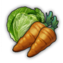 | Vegetables | 1500010836 | `vegetables-jakob`| `ow-vegetables-jakob` | 1 
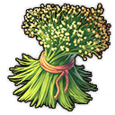 | Flax | 114365 | `hemp-jakob` | `ow-flax-jakob` | 1 
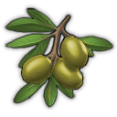 | Olives | 1500010105 | `olives-jakob` | `ow-olive-oil-jakob`
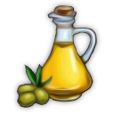| Olive Oil | 1500011326  | `olive-oil` | `ow-olive-oil-jakob`
 | Milk | 5385 | vanilla | `ow-cheese-jakob` | 1 
 | Cheese | 1500010102 | `cheese-jakob` | `ow-cheese-jakob` (`New World Cities`) | 1 
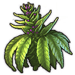 | Hemp | 1440224 | `hemp-jakob` | `ow-hemp-jakob` (`New Horizons`, Asia)
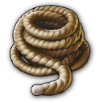 | Ropes | 1500010825 | `ropes-jakob` | `ow-ropes-jakob` | 500 
 | Tools | 1500010153 | `tools-jakob` | `ow-tools-jakob` | 900 
 | Sardines | 1500010120 | `sardines-jakob` | (`ow-sardines-jakob`) | 900 
 | Linen | 114391 | vanilla | `ow-linen-jakob`
 | Suits | 1500010127 | `suits-jakob` | (`ow-suits-jakob`) | 900 
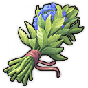 | Herbs | 5383 | vanilla | `ow-herbs-jakob` (`shared_herb_garden_kurila`) *compatible, differ in fertility*(`ow-tea-jakob`) | 900 
 | Tea | 1500010847 | `tea-jakob` | (`ow-tea-jakob`) | 900 

## Kurila's Shared Product
| | Name | GUID | Product
---|---|---|---
 | Apple | 1404420032 | `apples_kurila` | `shared_apple_orchard_kurila` (Old Word) | 900 
 | Barrels  | 1500300000 | `barrels_kurila` |
 | Cattle | 1404422300 | `cattle_kurila` |
 | Cherries | 1404420030 | `cherries_kurila` |
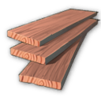 | Cherry Timber | 1500301151 | `cherry_timber_kurila` |
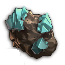 | Chrome | 1500301156 | `chrome_kurila` |
 | Coloured Tiles | 1500301073 | `coloured_tiles_kurila` |
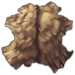 | Hides | 1500301152 | `hides_kurila` |
 | Liqueur | 1500300040 | `liqueur_kurila` |
 | Palm Oil | 1500301158 | `palm_oil_kurila` |
 | Pralines | 1500301160 | `pralines_kurila` |
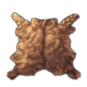 | Raw Furs | 1500301154 | `raw_furs_kurila` |
 | Rubber | 1500301162 | `rubber_kurila` |
 | Sandwiches | 1500300060 | `sandwiches_kurila` |
 | Sewing Thread | 1500020010 | `sewing_thread_kurila` |
 | Smoked Fish | 1500300020 | `smoked_fish_kurila` |
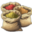 | Spice Powder | 1500301148 | `spice_powder_kurila` |
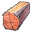 | Wanza Wood | 1500301150 | `wanza_wood_kurila` |
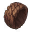 | Wooden Jewelry | 1500010150 | `wooden_jewelry_kurila` |
 | Wool Fabric | 1500020000 | `wool_fabric_kurila` |

## Taludas' Shared Product
| | Name | GUID | Product
---|---|---|---
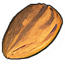 | Almonds | 1999005084 | `Taludas_sharedproduct_almonds`| `Taludas_shared_importdock_almonds` |
 | Apple Cider | 1999005051 | `sharedproduct_applecider_taludas` |
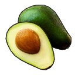 | Avocados | 1999002209 | `sharedproduct_avocados_taludas` | `sharedproduction_avocados_taludas`
| Diamonds | 1999005087 | `Taludas_sharedproduct_diamonds` | `Taludas_shared_importdock_diamonds`
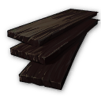 | Ebony | 1999005093 | `Taludas_sharedproduct_ebony` | `Taludas_shared_importdock_ebony`
 | Fish Stew | 1999005054 | `sharedproduct_fishstew_taludas` |  |
 | Guacamole | 1999002215 | `sharedproduct_guacamole_taludas` | `sharedproduction_guacamole_taludas`
 | Honey | 1440232 | `sharedproduct_honey_taludas` | (`New Horizons`, Asia)
 | Lacquerware | 1999005078 | `sharedproduct_lacquerware_taludas` |
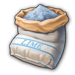 | Limestone (renamed cement) | 1010231 | `sharedproduct_limestone_taludas` | vanilla
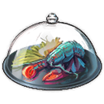 | Lobster Dinner | 1999005075 | `sharedproduct_lobsterdinner_taludas` |
 | Luxury Furniture | 1999005072 | `sharedproduct_luxuryfurniture_taludas` |
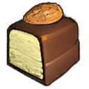 | Marzipan | 1999005057 | `sharedproduct_marzipan_taludas` |
 | Paintings | 1999005069 | `sharedproduct_paintings_taludas` |
 | Potash | 1999002211 | `sharedproduct_potash_taludas` | `sharedproduction_potash_taludas`
| Saffron | 1999005090 | `Taludas_sharedproduct_saffron` | `Taludas_shared_importdock_saffron`
| Silk Fabric | 1440209 | `Taludas_sharedproduct_silkfabric` | `Taludas_shared_importdock_silk` (`New Horizons`, Asia)
| Soda | 1999002300 | `sharedproduct_soda_taludas` | (`lion053_Enbesa_Spectacles_Production`, Enbesa) (`shared_soda_factory_kurila`, Old World)
| Sweets | 1999005060 | `sharedproduct_sweets_taludas` |
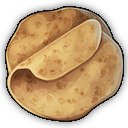 | Tortillas | 1999002213 | `sharedproduct_tortillas_taludas` | `sharedproduction_tortillas_taludas`
| Wine (renamed Champagne) | 120016 | `sharedproduct_wine_taludas` | vanilla

## Hieronimus' Shared Product
| | Name | GUID | Product
---|---|---|---
 | Horses | 1999005084 | `shared_goods_horses`|
 | Clean Water | 1742100242 | `shared_goods_clean_water`|
 | Galena | 1742100433 | `shared_goods_galena` |
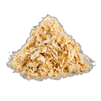 | Sawdust | 1800000302 | `shared_goods_sawdust` |
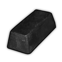 | Lead | 1742100435 | `shared_goods_lead` |
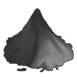 | Gunpowder | 1742100293 | `shared_goods_gunpowder` |
 | Strings | 1999005051 | `shared_goods_strings` |
 | Qilaut | 1999005051 | `shared_goods_qilaut` |
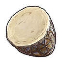 | Djembe | 1742110017 | `shared_goods_djembe` |
 | Flute | 1742110098 | `shared_goods_flutes` |

## Drakkam's Shared Product
| | Name | GUID | Product
---|---|---|---
 | Camera | 1555000169 | `cameras-Drakkam`|
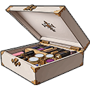 | Cosmetics | 1555000274 | `cosmetics-Drakkam`|
 | Eggs | 1555000100 | `eggs-Drakkam`|
 | Fedora | 1555000124 | `fedora-Drakkam`|
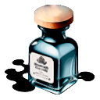 | Ink | 1555000161 | `ink-Drakkam`|
 | Lenses | 1555000171 | `lenses-Drakkam`|
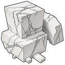 | Marble Stone | 1555000091 | `Marble-Slabs-Drakkam`|
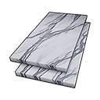 | Marble Slabs | 1555000093 | `Marble-Slabs-Drakkam`|
 | Tomatoes | 1555000109 | `tomatoes-Drakkam`|

## Lions' Shared Product
| | Name | GUID | ModID
---|---|---|---
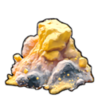 | Sulfur | 2100115089 | `shared-sulfur-production-lion053`

## Khobs' Shared Product
| | Name | GUID | ModID
---|---|---|---
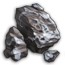 | Slag | 2143505583 | `shared_goods_slag`
 | Fabric | 2143505621 | `shared_goods_fabric`
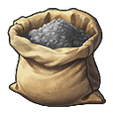 | Coke | tdb | `shared_goods_coke`
